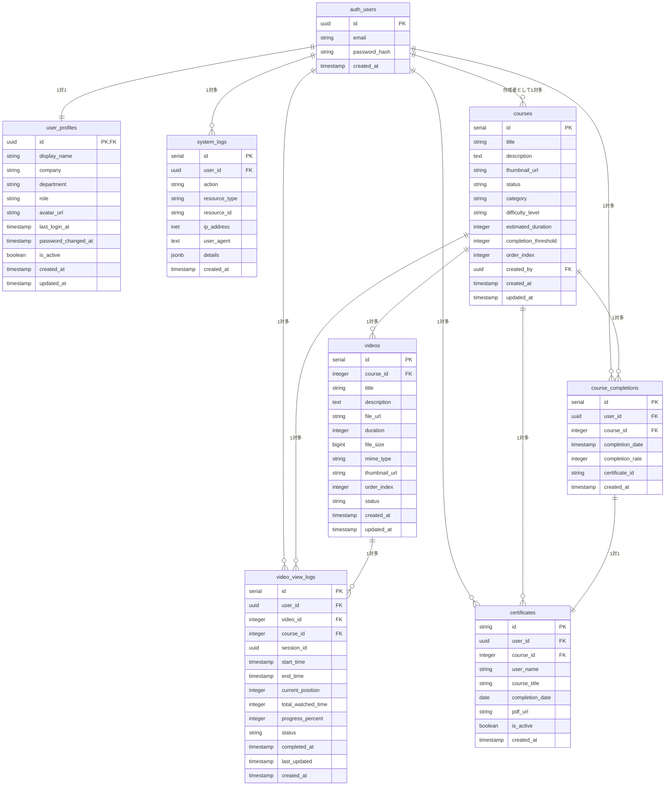
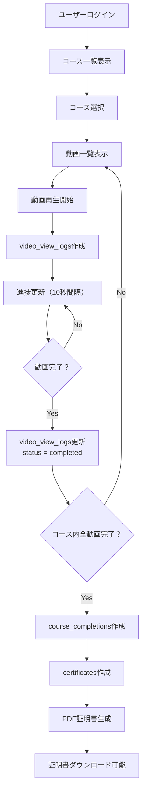
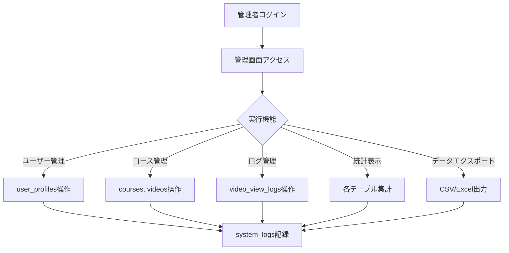

# LMSデータベース設計・ER図・機能仕様書

## 1. データベース関連図（ER図）



## 2. テーブル関係詳細

### 2.1 主要な関連

| 親テーブル | 子テーブル | 関係 | 制約 | 説明 |
|------------|------------|------|------|------|
| `auth.users` | `user_profiles` | 1:1 | CASCADE | ユーザー基本情報の拡張 |
| `auth.users` | `video_view_logs` | 1:多 | CASCADE | ユーザーの視聴履歴 |
| `auth.users` | `course_completions` | 1:多 | CASCADE | ユーザーのコース完了記録 |
| `auth.users` | `certificates` | 1:多 | CASCADE | ユーザーの証明書 |
| `auth.users` | `courses` | 1:多 | SET NULL | コース作成者 |
| `courses` | `videos` | 1:多 | CASCADE | コースに含まれる動画 |
| `courses` | `video_view_logs` | 1:多 | CASCADE | コースの視聴ログ |
| `courses` | `course_completions` | 1:多 | CASCADE | コース完了記録 |
| `videos` | `video_view_logs` | 1:多 | CASCADE | 動画の視聴ログ |
| `course_completions` | `certificates` | 1:1 | - | 完了記録と証明書の紐付け |

### 2.2 複合キー・ユニーク制約

| テーブル | 制約 | 列 | 目的 |
|----------|------|-----|------|
| `video_view_logs` | UNIQUE | `user_id, video_id` | 1ユーザー1動画1レコード |
| `course_completions` | UNIQUE | `user_id, course_id` | 1ユーザー1コース1完了記録 |
| `certificates` | UNIQUE | `certificate_id` | 証明書IDの一意性 |

### 2.3 インデックス設計

```sql
-- パフォーマンス最適化用インデックス
CREATE INDEX idx_video_view_logs_user_course ON video_view_logs(user_id, course_id);
CREATE INDEX idx_video_view_logs_progress ON video_view_logs(progress_percent, status);
CREATE INDEX idx_courses_status_category ON courses(status, category);
CREATE INDEX idx_videos_course_order ON videos(course_id, order_index);
CREATE INDEX idx_certificates_user ON certificates(user_id);
CREATE INDEX idx_system_logs_user_action ON system_logs(user_id, action);
CREATE INDEX idx_user_profiles_company ON user_profiles(company);
CREATE INDEX idx_user_profiles_role ON user_profiles(role);
```

## 3. データフロー図

### 3.1 学習進捗フロー



### 3.2 管理者機能フロー



## 4. 機能とテーブルの対応表

### 4.1 認証・ユーザー管理機能

| 機能ID | 機能名 | 主要テーブル | 操作 | 説明 |
|--------|--------|--------------|------|------|
| AUTH-01 | ログイン | `auth.users`, `user_profiles` | SELECT | 認証情報確認・プロフィール取得 |
| AUTH-02 | ログアウト | `user_profiles` | UPDATE | `last_login_at`更新 |
| AUTH-03 | パスワードリセット | `auth.users` | UPDATE | パスワードハッシュ更新 |
| AUTH-04 | 初回パスワード変更 | `user_profiles` | UPDATE | `password_changed_at`更新 |
| AUTH-05 | セッション管理 | `system_logs` | INSERT | ログイン・ログアウトログ |
| USER-01 | プロフィール表示 | `user_profiles` | SELECT | ユーザー情報表示 |
| USER-02 | プロフィール編集 | `user_profiles` | UPDATE | 表示名・会社情報更新 |
| USER-03 | アバターアップロード | `user_profiles` | UPDATE | `avatar_url`更新 |
| USER-04 | パスワード変更 | `auth.users`, `user_profiles` | UPDATE | パスワード・変更日時更新 |
| USER-05 | ユーザー一覧 | `user_profiles` | SELECT | 管理者向け全ユーザー取得 |
| ROLE-01 | 権限制御 | `user_profiles` | SELECT | `role`による制御 |
| ROLE-02 | アクセス制御 | `user_profiles` | SELECT | RLSによる制御 |
| ROLE-03 | 権限変更 | `user_profiles` | UPDATE | `role`更新 |

### 4.2 コース・動画管理機能

| 機能ID | 機能名 | 主要テーブル | 操作 | 説明 |
|--------|--------|--------------|------|------|
| COURSE-01 | コース一覧表示 | `courses` | SELECT | アクティブコース取得 |
| COURSE-02 | コース詳細表示 | `courses`, `videos`, `video_view_logs` | SELECT | コース・動画・進捗情報 |
| COURSE-03 | コース検索 | `courses` | SELECT | タイトル・カテゴリ検索 |
| COURSE-04 | カテゴリフィルタ | `courses` | SELECT | カテゴリ別絞り込み |
| COURSE-05 | 難易度表示 | `courses` | SELECT | `difficulty_level`表示 |
| COURSE-M01 | コース作成 | `courses` | INSERT | 新規コース作成 |
| COURSE-M02 | コース編集 | `courses` | UPDATE | コース情報更新 |
| COURSE-M03 | コース削除 | `courses` | UPDATE | `status = inactive` |
| COURSE-M04 | 公開設定 | `courses` | UPDATE | `status`更新 |
| COURSE-M05 | 完了閾値設定 | `courses` | UPDATE | `completion_threshold`更新 |
| VIDEO-01 | 動画再生 | `videos`, `video_view_logs` | SELECT, INSERT/UPDATE | 動画情報・視聴ログ |
| VIDEO-02 | 再生位置記憶 | `video_view_logs` | SELECT, UPDATE | `current_position`管理 |
| VIDEO-03 | 全画面表示 | - | - | フロントエンドのみ |
| VIDEO-M01 | 動画アップロード | `videos` | INSERT | 動画メタデータ登録 |
| VIDEO-M02 | 動画情報編集 | `videos` | UPDATE | 動画情報更新 |
| VIDEO-M03 | 動画削除 | `videos` | UPDATE | `status = inactive` |
| VIDEO-M04 | サムネイル設定 | `videos` | UPDATE | `thumbnail_url`更新 |
| VIDEO-M05 | 動画順序設定 | `videos` | UPDATE | `order_index`更新 |

### 4.3 学習進捗管理機能

| 機能ID | 機能名 | 主要テーブル | 操作 | 説明 |
|--------|--------|--------------|------|------|
| PROGRESS-01 | 視聴時間記録 | `video_view_logs` | INSERT/UPDATE | リアルタイム進捗記録 |
| PROGRESS-02 | 進捗率計算 | `video_view_logs` | UPDATE | `progress_percent`計算 |
| PROGRESS-03 | 完了判定 | `video_view_logs`, `course_completions` | UPDATE, INSERT | 完了閾値判定 |
| PROGRESS-04 | 進捗同期 | `video_view_logs` | SELECT/UPDATE | デバイス間同期 |
| PROGRESS-05 | オフライン対応 | `video_view_logs` | INSERT | 後からデータ同期 |
| PROGRESS-D01 | 個人ダッシュボード | `courses`, `video_view_logs`, `course_completions` | SELECT | 個人進捗集計 |
| PROGRESS-D02 | プログレスバー | `video_view_logs` | SELECT | 進捗率表示 |
| PROGRESS-D03 | 学習統計 | `video_view_logs`, `course_completions` | SELECT | 統計計算 |
| PROGRESS-D04 | 学習履歴 | `video_view_logs` | SELECT | 視聴履歴表示 |
| PROGRESS-D05 | 学習カレンダー | `video_view_logs` | SELECT | 日別学習記録 |

### 4.4 証明書管理機能

| 機能ID | 機能名 | 主要テーブル | 操作 | 説明 |
|--------|--------|--------------|------|------|
| CERT-01 | 自動証明書生成 | `course_completions`, `certificates` | INSERT | 完了時自動生成 |
| CERT-02 | 証明書ダウンロード | `certificates` | SELECT | PDF取得 |
| CERT-03 | 証明書一覧 | `certificates` | SELECT | 取得済み証明書 |
| CERT-04 | 証明書再発行 | `certificates` | UPDATE | PDF再生成 |
| CERT-05 | 証明書検証 | `certificates` | SELECT | ID検証 |
| CERT-C01 | テンプレート設定 | - | - | 設定ファイル管理 |
| CERT-C02 | 会社情報設定 | - | - | 設定ファイル管理 |
| CERT-C03 | 署名設定 | - | - | 設定ファイル管理 |

### 4.5 管理者機能

| 機能ID | 機能名 | 主要テーブル | 操作 | 説明 |
|--------|--------|--------------|------|------|
| ADMIN-U01 | ユーザー一覧 | `user_profiles` | SELECT | 全ユーザー管理 |
| ADMIN-U02 | ユーザー検索 | `user_profiles` | SELECT | 条件検索 |
| ADMIN-U03 | ユーザー詳細 | `user_profiles`, `video_view_logs`, `course_completions` | SELECT | 詳細情報・学習状況 |
| ADMIN-U04 | 権限変更 | `user_profiles` | UPDATE | `role`変更 |
| ADMIN-U05 | アカウント無効化 | `user_profiles` | UPDATE | `is_active = false` |
| ADMIN-L01 | 視聴ログ一覧 | `video_view_logs` | SELECT | 全ログ表示 |
| ADMIN-L02 | ログ検索フィルタ | `video_view_logs` | SELECT | 条件絞り込み |
| ADMIN-L03 | ログ手動編集 | `video_view_logs` | UPDATE | 視聴記録修正 |
| ADMIN-L04 | ログ削除 | `video_view_logs` | DELETE | 不要レコード削除 |
| ADMIN-L05 | ログ一括処理 | `video_view_logs` | INSERT/UPDATE | CSV処理 |
| ADMIN-R01 | 統計ダッシュボード | 全テーブル | SELECT | 集計・分析 |
| ADMIN-R02 | 完了率レポート | `course_completions`, `courses`, `user_profiles` | SELECT | 完了率計算 |
| ADMIN-R03 | 学習時間レポート | `video_view_logs` | SELECT | 時間集計 |
| ADMIN-R04 | データエクスポート | 各テーブル | SELECT | CSV/Excel出力 |
| ADMIN-R05 | 定期レポート | 各テーブル | SELECT | 自動レポート生成 |

### 4.6 システム管理機能

| 機能ID | 機能名 | 主要テーブル | 操作 | 説明 |
|--------|--------|--------------|------|------|
| SYS-01 | サイト基本設定 | - | - | 設定ファイル管理 |
| SYS-02 | 通知設定 | - | - | メール設定 |
| SYS-03 | セキュリティ設定 | - | - | ポリシー設定 |
| SYS-04 | バックアップ設定 | 全テーブル | SELECT | データバックアップ |
| SYS-05 | ログ設定 | `system_logs` | INSERT | システムログ記録 |

## 5. データ整合性とビジネスルール

### 5.1 主要なビジネスルール

| ルール | 実装方法 | 関連テーブル |
|--------|----------|--------------|
| 1ユーザー1動画1視聴ログ | UNIQUE制約 | `video_view_logs(user_id, video_id)` |
| 1ユーザー1コース1完了記録 | UNIQUE制約 | `course_completions(user_id, course_id)` |
| 完了閾値による自動完了 | トリガー/アプリケーション | `video_view_logs.progress_percent >= courses.completion_threshold` |
| 証明書ID一意性 | UNIQUE制約 | `certificates.id` |
| 論理削除によるデータ保持 | `status`フラグ | `courses.status`, `videos.status` |
| アクティブユーザーのみログイン | `is_active`チェック | `user_profiles.is_active` |

### 5.2 データ整合性チェック

```sql
-- 整合性チェッククエリ例

-- 1. 孤立した視聴ログ（存在しないコース・動画を参照）
SELECT * FROM video_view_logs vl
LEFT JOIN courses c ON vl.course_id = c.id
LEFT JOIN videos v ON vl.video_id = v.id
WHERE c.id IS NULL OR v.id IS NULL;

-- 2. 証明書なき完了記録
SELECT * FROM course_completions cc
LEFT JOIN certificates cert ON cc.certificate_id = cert.id
WHERE cert.id IS NULL;

-- 3. 進捗率異常値
SELECT * FROM video_view_logs
WHERE progress_percent < 0 OR progress_percent > 100;

-- 4. 完了日時の論理矛盾
SELECT * FROM video_view_logs
WHERE status = 'completed' AND completed_at IS NULL;

-- 5. 動画時間と視聴時間の矛盾
SELECT vl.*, v.duration
FROM video_view_logs vl
JOIN videos v ON vl.video_id = v.id
WHERE vl.total_watched_time > v.duration * 1.1; -- 10%のマージン
```

## 6. パフォーマンス考慮事項

### 6.1 頻繁なクエリパターン

| クエリパターン | 頻度 | 最適化方法 |
|----------------|------|------------|
| ユーザーの学習進捗取得 | 高 | `idx_video_view_logs_user_course` |
| コース一覧（アクティブのみ） | 高 | `idx_courses_status_category` |
| 動画一覧（コース内順序） | 高 | `idx_videos_course_order` |
| 完了率集計 | 中 | 集計テーブル検討 |
| 学習時間レポート | 低 | バッチ処理検討 |

### 6.2 データ増加予測

| テーブル | 月間増加予測 | 年間予測 | 対策 |
|----------|--------------|----------|------|
| `video_view_logs` | 10,000件 | 120,000件 | パーティショニング検討 |
| `system_logs` | 50,000件 | 600,000件 | 定期削除（1年保持） |
| `certificates` | 200件 | 2,400件 | 問題なし |
| `courses`, `videos` | 10件 | 120件 | 問題なし |

### 6.3 バックアップ・アーカイブ戦略

| データ種別 | 保持期間 | アーカイブ方法 |
|------------|----------|----------------|
| 学習ログ | 3年 | 年次パーティション |
| システムログ | 1年 | 月次削除 |
| ユーザーデータ | 永続 | 定期バックアップ |
| 証明書データ | 5年 | 年次アーカイブ |

## 7. セキュリティ考慮事項

### 7.1 Row Level Security (RLS) ポリシー

```sql
-- ユーザーは自分のデータのみアクセス可能
CREATE POLICY "users_own_data" ON user_profiles
FOR ALL USING (auth.uid() = id);

-- 管理者は全データアクセス可能
CREATE POLICY "admin_full_access" ON user_profiles
FOR ALL USING (
  EXISTS (
    SELECT 1 FROM user_profiles 
    WHERE id = auth.uid() AND role = 'admin'
  )
);

-- 学習ログは本人と管理者のみ
CREATE POLICY "progress_access" ON video_view_logs
FOR ALL USING (
  auth.uid() = user_id OR
  EXISTS (
    SELECT 1 FROM user_profiles 
    WHERE id = auth.uid() AND role = 'admin'
  )
);
```

### 7.2 監査ログ対象

| 操作 | 記録内容 | 保持期間 |
|------|----------|----------|
| ログイン・ログアウト | IP、UserAgent、時刻 | 1年 |
| 権限変更 | 変更者、対象者、変更内容 | 3年 |
| データ削除 | 削除者、削除対象、削除理由 | 3年 |
| 管理者操作 | 全ての管理者操作 | 3年 |
| ログ編集 | 編集者、編集前後の値 | 3年 |

この設計書により、データベースの構造と各機能の関係が明確になり、開発時の参照資料として活用できます。